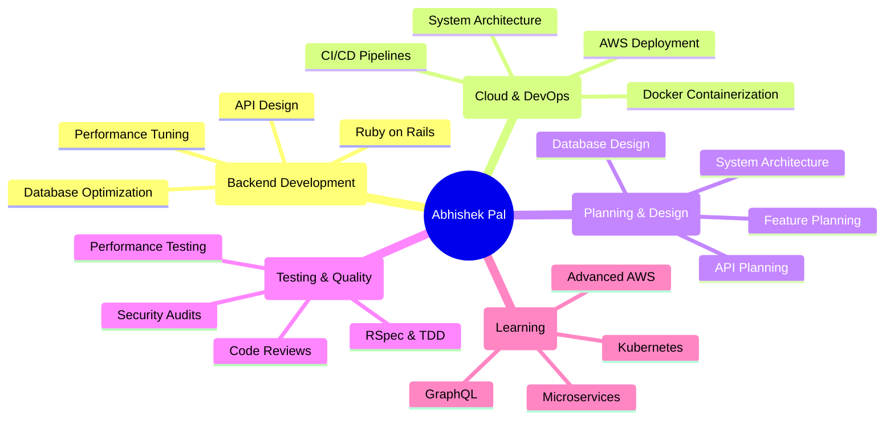

<div align="center">

<!-- Animated Header -->


<!-- Profile Views Counter -->


</div>

---

<div align="center">

### 🚀 About Me

```ruby
class Abhishek < Developer
  def initialize
    @name = "Abhishek Pal"
    @role = "Full Stack Ruby on Rails Developer"
    @company = "Magic EdTech"
    @location = "India"
    @experience = "4+ years"
    @responsibilities = "Everything - Planning, Development, DevOps, Architecture"
  end

  def current_focus
    [
      "Building robust backend systems",
      "API design & optimization", 
      "Cloud deployment & DevOps (AWS/Docker)",
      "Full project lifecycle management",
      "System architecture & planning"
    ]
  end

  def skills
    {
      languages: ["Ruby", "JavaScript", "SQL"],
      frameworks: ["Ruby on Rails", "React", "Stimulus"],
      databases: ["PostgreSQL", "MySQL", "Redis"],
      devops: ["Docker", "AWS EC2", "CI/CD", "Nginx"],
      testing: ["RSpec", "Minitest", "Capybara"],
      planning: ["System Design", "Database Architecture", "API Planning"]
    }
  end

  def working_style
    "Solo entrepreneur - handling everything from ideation to deployment"
  end
end
```

</div>

---

### 💼 Work Experience & Current Projects

<table>
<tr>
<td width="50%">

#### 🏢 Magic EdTech
**Backend Developer** | Present
- Building scalable EdTech platform
- API development & optimization
- Database design & performance tuning
- Full DevOps responsibility

</td>
<td width="50%">

#### 🎯 Personal Projects
- **Ath-app-be** - Sports facility booking system
- **MusicYou+1** - Music streaming platform
- **PetroPal** - Petroleum management system
- **Crema Co** - E-commerce solution

</td>
</tr>
</table>

---

### 🌟 Featured Project: Ath-app-be

<div align="center">

[](https://github.com/abhishek-ror/Ath-app-be)

</div>

A comprehensive sports facility booking and management platform built entirely by me - from planning to deployment.

#### 🎯 My Role & Responsibilities

**Everything!** As a solo developer, I handle:

<table>
<tr>
<td width="33%">

**🎨 Planning & Design**
- System architecture design
- Database schema planning
- API endpoint design
- User flow mapping
- Feature prioritization

</td>
<td width="33%">

**💻 Development**
- Backend development (Rails)
- RESTful API implementation
- Database optimization
- Payment integration (Razorpay)
- QR code verification system
- Real-time booking management

</td>
<td width="33%">

**🚀 DevOps & Deployment**
- Docker containerization
- AWS EC2 deployment
- CI/CD pipeline setup
- Database migrations
- Server configuration
- SSL/Security setup
- Performance monitoring

</td>
</tr>
</table>

#### 🛠️ Tech Stack

```ruby
{
  backend: "Ruby on Rails 8.0",
  database: "PostgreSQL with Redis caching",
  authentication: "JWT with Devise",
  payments: "Razorpay integration",
  media: "Active Storage with Cloudinary",
  background_jobs: "Sidekiq",
  deployment: "Docker + AWS EC2",
  web_server: "Puma + Nginx",
  testing: "RSpec + Capybara"
}
```

#### ✨ Key Features

- 🏟️ **Multi-Sport Facility Management** - Manage various sports venues and their amenities
- 📅 **Smart Time Slot Booking** - Dynamic slot availability with conflict prevention
- 💳 **Integrated Payment System** - Razorpay for secure transactions
- 📱 **QR Code Verification** - Digital check-in system for bookings
- 📊 **Admin Dashboard** - Comprehensive analytics and management
- 🔔 **Automated Notifications** - Email alerts for bookings and reminders
- 🗺️ **Location-Based Search** - Find facilities near you
- ⚡ **Real-time Availability** - Live slot status updates

#### 📈 Project Highlights

- **Built from scratch** - Complete ownership of architecture and implementation
- **Production-ready** - Deployed on AWS with proper DevOps practices
- **Scalable design** - Built to handle growing user base
- **Test coverage** - Comprehensive test suite with RSpec
- **API-first approach** - Clean RESTful API design
- **Performance optimized** - Redis caching, query optimization

---

### 🛠️ Tech Arsenal

<div align="center">

#### Languages & Frameworks


#### Databases & Caching


#### DevOps & Cloud


#### Tools & Others


</div>

---

### 📊 GitHub Analytics

<div align="center">
  
  
</div>

<div align="center">
  
</div>

<div align="center">
  
</div>

---

### 🏆 GitHub Trophies

<div align="center">
  
</div>

---

### 💡 What I Believe In

<div align="center">

```
┌────────────────────────────────────────────────────────┐
│  ✨ Clean, testable & scalable code                    │
│  🧪 Test-driven development (TDD)                      │
│  📚 Continuous learning & improvement                  │
│  🤝 Taking full ownership from ideation to deployment  │
│  ⚡ Performance optimization                           │
│  🎯 User-centric design                                │
│  🚀 DevOps best practices                              │
└────────────────────────────────────────────────────────┘
```

</div>

---

### 🎯 Current Focus

<div align="center">



</div>

---

### 📝 Latest Blog Posts

<!-- BLOG-POST-LIST:START -->
- 🚀 Building a Complete Sports Booking System: From Planning to Production
- 🐳 Docker + Rails: Production-Ready Deployment on AWS EC2
- ⚡ Optimizing ActiveRecord Queries for High-Performance Rails Apps
- 🧪 Advanced RSpec Testing: Building Bulletproof Rails Applications
- 💳 Integrating Razorpay Payment Gateway in Ruby on Rails
<!-- BLOG-POST-LIST:END -->

---

### 🎨 Random Dev Quote

<div align="center">


</div>

---

### 🎵 Fun Facts

<div align="center">

🤼 Die-hard Kabaddi fan | 🎶 Music fuels my coding sessions  
🌏 Always exploring new tech | 😄 Fluent in emoji  
☕ Coffee > Tea (always!) | 🎮 Weekend gamer  
🏗️ Love building things from scratch | 🚀 DevOps enthusiast

</div>

---

### 📫 Let's Connect & Collaborate

<div align="center">

[](https://abhishek-pal-1blwc5l.gamma.site/)
[](https://www.linkedin.com/in/developer-abhishek/)
[](mailto:apal51640@gmail.com)
[](https://instagram.com/er.abhishek.pal)
[](https://twitter.com/abhishek_ror)
[](https://dev.to/abhishek_ror)

</div>

---

### 💰 Support My Work

<div align="center">

[](https://buymeacoffee.com/abhishekror)
[](https://paypal.me/abhishekror)
[](https://github.com/sponsors/abhishek-ror)

</div>

---

<div align="center">

### 🐍 Contribution Snake


</div>

---

<div align="center">

### 📈 Profile Stats

<table>
<tr>
<td>

**🔥 Streak Stats**
<br/>


</td>
<td>

**⚡ Recent Activity**
<br/>
<!--START_SECTION:activity-->
1. 🎉 Merged PR in Ath-app-be
2. 💪 Deployed new features to production
3. 🗣 Optimized database queries
4. 🚀 Configured CI/CD pipeline
<!--END_SECTION:activity-->

</td>
</tr>
</table>

</div>

---

<div align="center">

### 💬 Visitors Count


</div>

---

<div align="center">

**Made with ❤️ by a developer who does it all - Planning, Development & DevOps**


</div>

